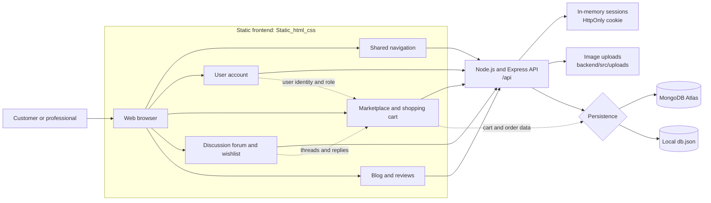

# SGS1_G6_A1_REPORT
"A .zip of the team Github repository with a README.md file containing Team member names and the module(s) each member is responsible for and list of files and folders which each member is responsible for."
| Team member names_ID | Modules | Files & Folders |
| :--- | :--- | :--- |
| Do Dac Loc_s4178227 | *"Blog"* | •  |
| Nguyen Huu Khoi_s4162137|"Shopping Cart and User Account Management" | |
| Nguyen Anh Khoi_s4216408|"Review and Rating"||
| Duong Quang Tam_s4197086|"Discussion forum and Wishlist"| "Discuss_forum" folder|

## Application Configuration

### Backend

## System Architecture



The browser loads the static frontend modules and sends authenticated requests to the Express API. The API uses MongoDB Atlas when configured and falls back to `backend/src/data/db.json` for local development. Cart data is associated with a browser session, while orders preserve the cart items and checkout details.

The backend is located in `Static_html_css/backend` and requires Node.js and
npm. Install its dependencies and start the API from the repository root:

```powershell
npm --prefix .\Static_html_css\backend install
npm --prefix .\Static_html_css\backend start
```

The API listens on `http://localhost:5000` by default. To change the port,
set `PORT` in `Static_html_css/backend/.env`.

### MongoDB Atlas

Create `Static_html_css/backend/.env` from `.env.example` and configure the
MongoDB Atlas connection:

```env
MONGODB_URI=mongodb+srv://<username>:<db_password>@<cluster-host>/?appName=Cluster0
MONGODB_DB_NAME=rshop
PORT=5000
```

Before starting the backend:

1. Add the machine's IP address to the Atlas network access list.
2. Create a database user with access to the selected database.
3. URL-encode special characters in the database username or password.
4. Keep `.env` private. It is excluded by `backend/.gitignore` and must not
	 be committed or shared publicly.

When `MONGODB_URI` is configured, the backend uses MongoDB as its persistent
data store. Without it, the backend falls back to `backend/src/data/db.json`
for local development. The configured database is normally named `rshop`.

### Frontend

The static frontend expects the backend API at `http://localhost:5000/api`.
Start the backend before opening the pages under `Static_html_css`. If the
backend runs on another host or port, update the API base URL in the relevant
frontend JavaScript files, including `shopping_cart/js/main.js` and the shared
account/module scripts.

### Configuration Files

- `Static_html_css/backend/.env.example`: safe configuration template.
- `Static_html_css/backend/.env`: local secrets and environment settings; do
	not commit this file.
- `Static_html_css/backend/DATABASE_SCHEMA.md`: persisted data model and
	collection relationships.
